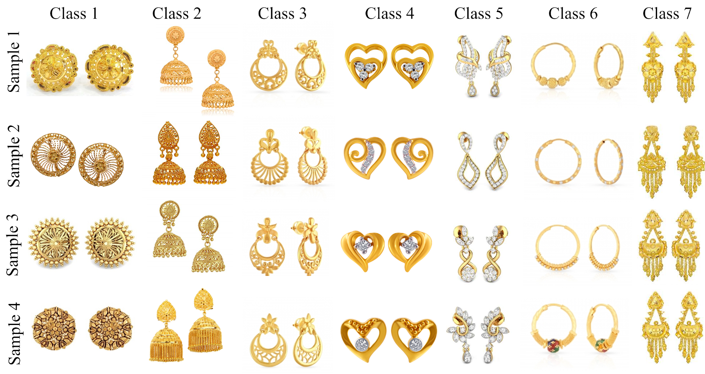

### Publication
Islam S.M., Joardar S., Sekh A.A. (2021) RingFIR: A Large Volume Earring Dataset for Fashion Image Retrieval. 
In: Singh S.K., Roy P., Raman B., Nagabhushan P. (eds) Computer Vision and Image Processing. CVIP 2020. 
Communications in Computer and Information Science, vol 1377. Springer, Singapore. 
[Link to The Paper](https://doi.org/10.1007/978-981-16-1092-9_9)

### Dataset Description
We have collected an ornament dataset of golden earrings. It contains 2,651 high-resolution
golden earring images from different jewellery chain catalogues. These images are also used in online shopping apps.

### License

Copyright © 2021 Sk. Arif Ahmed

The content of this repository is bound by the following licenses:

- The documents and data are licensed under the MIT license.
